# How a query flows through Grackle

Grackle is a compiler/interpreter: a request is parsed once, elaborated into an executable query
algebra, then interpreted against a `Mapping` to produce `Json`. The pipeline itself is fixed - no
backend replaces the compiler or the interpreter - and a `Mapping` plugs into it at the handful of
points highlighted below. That is why we can mix `ValueMapping`, `SqlMapping`, effects and
`ComposedMapping` freely: they differ mainly in how they build cursors, and everything either side
of that is shared. `ValueMapping`, `GenericMapping`, `CirceMapping` and `ComposedMapping` each
override `mkCursorForMappedField`, falling through to `super` for the cases they do not handle;
`SqlMapping` instead overrides `defaultRootCursor`, because it materialises a whole subtree from a
single query rather than a cursor per field. `SelectElaborator`, `RootEffect`/`RootStream` and
`EffectHandler` are orthogonal to that choice: they work under any of them.

```mermaid
flowchart TD
    Req["GraphQL request<br/>query text + variables + request Env"]

    subgraph S1["① Parse — GraphQLParser / QueryParser"]
        direction TB
        P1["GraphQLParser.parseText<br/>text → Ast.Document"]
        P2["QueryParser.parseDocument<br/>Ast.Document → untyped query algebra<br/>(UntypedOperation + UntypedFragment)"]
        P1 --> P2
    end

    subgraph S2["② Compile — QueryCompiler.compile"]
        direction TB
        C1["compileVarDefs / compileVars<br/>bind request variables against the schema"]
        C2["Phase chain, threaded through the Elab state monad<br/>ElabState carries Context + Vars + Fragments + Env"]
        C3["IntrospectionElaborator"]
        C4["VariablesSkipAndFragmentElaborator<br/>substitute vars, resolve @skip/@include, expand fragments"]
        C5["MergeFields"]
        C6["mapping.selectElaborator<br/>per field: arguments → Filter / Unique / Elab.env(...)"]
        C7["ComponentElaborator<br/>wraps Delegate fields in Component nodes"]
        C8["EffectElaborator<br/>wraps EffectField selections in Effect nodes"]
        C9["any custom phases the mapping appends<br/>by overriding compilerPhases"]
        C1 --> C2 --> C3 --> C4 --> C5 --> C6 --> C7 --> C8 --> C9
    end

    subgraph S3["③ Interpret — QueryInterpreter.run"]
        direction TB
        I1["RootCursor built from rootTpe + request Env"]
        I2{"root selects"}
        I3["RootEffect.effect(query, path, env)<br/>← our I/O happens here, inside F"]
        I4["runValue / runFields / runList<br/>walk the Query tree against the Cursor tree"]
        I5["Environment node<br/>merges an elaborator-bound Env into the cursor"]
        I6["Component node<br/>hands the subtree to another Mapping"]
        I7["Effect node<br/>EffectHandler resolves a field, still batched"]
        I8["scalar/enum leaf<br/>cursor.asLeaf"]
        I9["ProtoJson<br/>partial result, may hold deferred subtrees"]
        I1 --> I2
        I2 -->|pure field| I4
        I2 -->|RootEffect field| I3 --> I4
        I4 --> I5 --> I9
        I4 --> I6 --> I9
        I4 --> I7 --> I9
        I4 --> I8 --> I9
    end

    subgraph S4["④ Complete — QueryInterpreter.completeAll"]
        direction TB
        D1["gather every deferred subtree<br/>(Component / Effect results) across the whole response"]
        D2["group by (Mapping, EffectHandler)"]
        D3["run each group once<br/>handler.runEffects / mapping.combineAndRun"]
        D4["recursively complete<br/>a batch can itself defer further work"]
        D5["scatter results back into place"]
        D1 --> D2 --> D3 --> D4 --> D5
    end

    Resp["Json response<br/>data + errors"]

    Req --> S1 --> S2 --> S3 --> S4 --> Resp

    classDef pluggable fill:#e8f0fe,stroke:#4a7fd6,stroke-width:1px,color:#1a1a1a;
    class C6,C7,C8,C9,I3,I6,I7 pluggable;
```



*(Highlighted boxes are the extension points a backend module actually supplies; everything else
is fixed machinery shared by every `Mapping`.)*

Notes:

- **`Env` is created in two different places, at two different times.** The `env` we pass to
  `compileAndRun`/`compileAndRunSubscription` is a *request-scoped* value (current user, tenant,
  a `DataSource`, ...) that we build once, outside Grackle, before compilation even starts. It
  seeds both the elaborator state and the `RootCursor`. Separately, `mapping.selectElaborator` can
  call `Elab.env(...)` *during compilation*, binding a field's arguments (or anything else) into
  the query tree as an `Environment` node - but that binding is not attached to any `Cursor` yet.
  It is only merged in *during interpretation*, when `runValue`/`runFields` reaches that
  `Environment` node and calls `cursor.withEnv`. This is why `CursorField`/`EffectField` functions
  see argument values via `cursor.env[T](...)`: by the time our function runs, both Envs have
  already been merged into the cursor it is handed.
- **Validation brackets the phase chain; the diagram does not show it.** Before any phase runs,
  `QueryCompiler.compile` rejects duplicate and self-referential fragment definitions and
  unresolvable spreads (`validateVariablesAndFragments`) and checks the GraphQL field-mergeability
  rules across the operation and everything its fragments reach (`validateFieldMergeability`).
  `compileOperation` then binds variable definitions, checks the query's directives against the
  schema (`Directive.validateDirectivesForQuery`) and validates every variable usage reachable from
  the operation (`VariableUsage.validateVariableUsages`), all before the fold over `allPhases`
  begins. A query which fails any of them never reaches a `Phase` at all, so a custom phase can
  assume the document is already well-formed in those respects. Note also that
  `IntrospectionElaborator`, drawn as an unconditional box above, is skipped entirely when
  introspection is `Disabled`.
- **Elaboration is where "arguments become behavior".** A raw `UntypedSelect` does not know what
  `character(id: "1000")` *means* - `mapping.selectElaborator` is what turns that into a `Filter`
  or `Unique` node (or an `Elab.env` binding) parameterized by the argument value. This is the
  piece that is most specific to the data source, and it is exactly what `SelectElaborator.apply`
  (see the [tutorial](tutorial/intro.md)) lets us supply.
- **Batching happens after the fact, not during the walk.** `runValue`/`runFields` build the
  result tree eagerly, but `Component` and `Effect` nodes do not run immediately - they produce a
  deferred `ProtoJson` marker. `completeAll` is what gathers *all* the deferred markers across the
  whole response, groups them by which `Mapping`/`EffectHandler` is responsible, and runs each
  group exactly once. That is the mechanism behind `SqlMapping`'s single-query-per-level joins and
  `EffectField`'s N+1-avoidance. Both are consumers of the same batching step.
- **Stage ② is open-ended.** `IntrospectionElaborator`, `VariablesSkipAndFragmentElaborator` and
  `MergeFields` always run first, in that order, and everything after them comes from the mapping's
  `compilerPhases`: by default `selectElaborator`, `componentElaborator`, `effectElaborator`, but a
  mapping can append phases of its own to enforce global policy on incoming queries. Grackle ships
  one such phase, `QuerySizeValidator`; see
  [Compiler Phases](howto/compiler-phases.md) for how to write and install our own.
- **`ComposedMapping` is this whole diagram, nested.** A `Component` node's "hand the subtree to
  another Mapping" step (`I6` above) means that sub-mapping runs its *own* copy of stages ②-④ on
  that subtree, with its own schema and its own `Env`. Stitching mappings together is possible
  precisely because every `Mapping` implements the same pipeline independently.

## What a phase is, and what it sees

Stage ② is a fold over a list of `QueryCompiler.Phase`s, run once per operation:

```scala
allPhases.foldLeftM(op.query) { (acc, phase) =>
  phase.transformFragments *> phase.transform(acc)
}
```

`Phase` has two entry points, and neither is abstract:

- **`transform(query: Query): Elab[Query]`** already does a complete recursive walk of the query
  algebra, pushing and popping the `Elab` context as it descends through `Narrow`, `Group`,
  `Filter`, `Unique`, `Count`, inline fragments and the rest, so that `Elab.context` is always the
  context of the node being visited. Override it for the node types we care about and delegate
  everything else to `super.transform(query)` - that is what every built-in phase does. A phase
  which handles a node itself and does not fall through stops the descent there.
- **`transformFragments: Elab[Unit]`** defaults to a no-op. Fragment *definitions* live in
  `ElabState`, not in the query tree, so `transform` never reaches inside them; a phase which has
  to rewrite fragment bodies overrides `transformFragments` and rewrites the map through
  `Elab.transformFragments`. Only phases running before fragments are inlined need this -
  `IntrospectionElaborator` is the one built-in that does, because `__schema` can be selected
  inside a fragment.

`transformSelect` and `validateSubselection` are the seams inside the default `transform`, for
hooking field descent rather than replacing the walk.

Where a phase sits in the list decides which nodes it can match on at all:

| Position | Selections are | Spreads | Component/Effect |
|---|---|---|---|
| before `VariablesSkipAndFragmentElaborator` | `UntypedSelect`, variables unsubstituted | `UntypedFragmentSpread` | absent |
| after it, before `selectElaborator` | `UntypedSelect`, arguments bound | inlined | absent |
| after `selectElaborator` | `Select`, wrapped in `Environment` where one was bound | inlined | absent |
| last, where `:+` puts ours | `Select` | inlined | present |

So `super.compilerPhases :+ new MyPhase`, the idiom in
[Compiler Phases](howto/compiler-phases.md), installs our phase at the end, where it sees a
fully elaborated tree: `Select` rather than `UntypedSelect`, no spreads, and whatever `Filter`,
`Limit`, `Count` or `Environment` nodes the mapping's own elaborator injected. Prepending with
`new MyPhase +: super.compilerPhases` gets us closer to what the client actually wrote, at the
cost of handling spreads and unsubstituted variables ourselves. A phase which matches on the wrong
one of `UntypedSelect`/`Select` for its position matches nothing, and silently does nothing.

A phase aborts compilation with `Elab.failure(msg)`, which fails the whole operation: the client
gets errors and no data.
